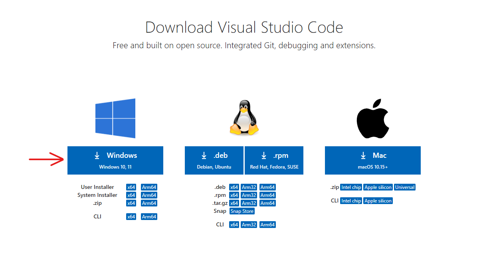
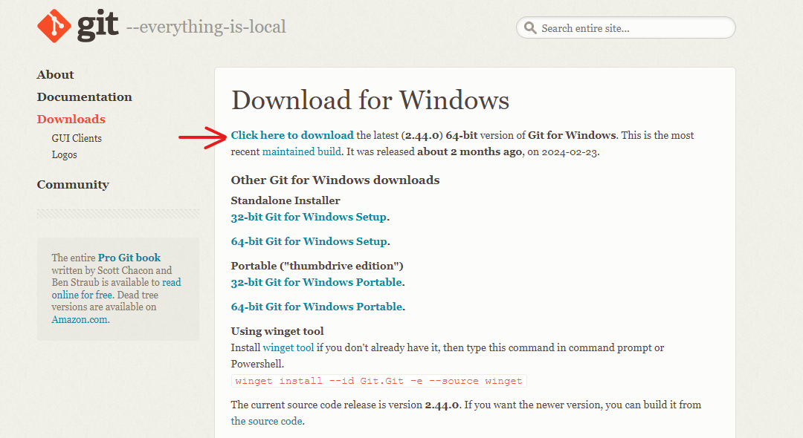
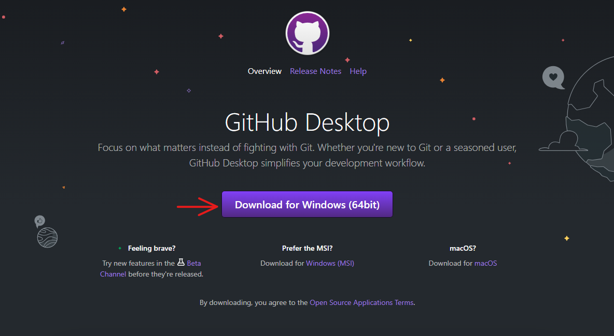
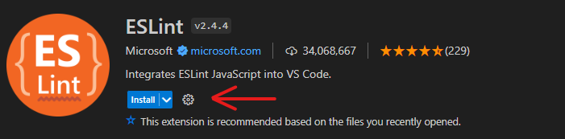
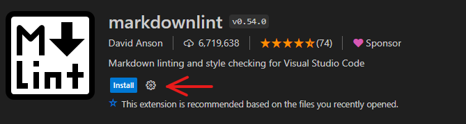
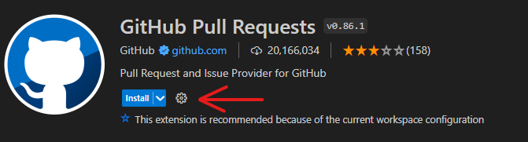
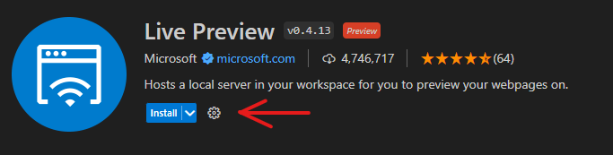
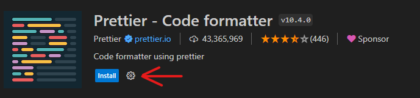
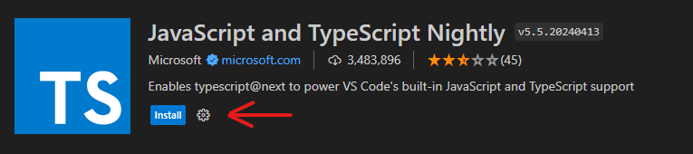

# Demo - Software Installation

## What are we doing today?

### 1. Installing software tools

- [VS Code](#1-vs-code)
- [Git for windows](#2-git-for-windows)
- [Github for desktop](#3-github-desktop)
- [Windows terminal (For windows 10)](#4-windows-terminal-for-windows-10)

### 2. Installing extensions (In VS Code)

- [ESLint](#1-eslint)
- [Markdownlint](#2-markdownlint)
- [Github Pull Requests](#3-github-pull-requests)
- [Live Preview](#4-live-preview)
- [Prettier - Code formatter](#5-prettier---code-formatter)
- [JavaScript and TypeScript Nightly](#6-javascript-and-typescript-nightly)

---------------------------------------------

## Installing software tools

### 1. VS Code

- Download link - <https://code.visualstudio.com/download>

- Click on the download button

- Back to [Top](#1-installing-software-tools)

### 2. Git for windows

- Download link - <https://git-scm.com/download/win>

- Click download

- Back to [Top](#1-installing-software-tools)

### 3. Github desktop

- Download link - <https://desktop.github.com/>

- Click on the download button

- Back to [Top](#1-installing-software-tools)

### 4. Windows Terminal (For windows 10)

- Download link - <https://apps.microsoft.com/detail/9n0dx20hk701?rtc=1&hl=en-in&gl=IN>

- Click on the download button

- Back to [Top](#1-installing-software-tools)

## Extensions for VS Code

### 1. ESLint

- Extension id - dbaeumer.vscode-eslint

  - Enter the extension id in the Extensions search box

  - Click on install

- Back to [Top](#2-installing-extensions-in-vs-code)

### 2. Markdownlint

- Extension id - davidanson.vscode-markdownlint

  - Enter the extension id in the Extensions search box

  - Click on install

- Back to [Top](#2-installing-extensions-in-vs-code)

### 3. Github Pull requests

- Extension id - github.vscode-pull-request-github

  - Enter the extension id in the Extensions search box

  - Click on install

- Back to [Top](#2-installing-extensions-in-vs-code)

### 4. Live Preview

- Extension id - ms-vscode.live-server

  - Enter the extension id in the Extensions search box

  - Click on install

- Back to [Top](#2-installing-extensions-in-vs-code)

### 5. Prettier - Code formatter

- Extension id - ms-vscode.live-server

  - Enter the extension id in the Extensions search box

  - Click on install

- Back to [Top](#2-installing-extensions-in-vs-code)

### 6. JavaScript and TypeScript Nightly

- Extension id - ms-vscode.vscode-typescript-next

  - Enter the extension id in the Extensions search box

  - Click on install

- Back to [Top](#2-installing-extensions-in-vs-code)

> NOTE:
>
> Always check the Publisher and install count of a software tool before installing!
