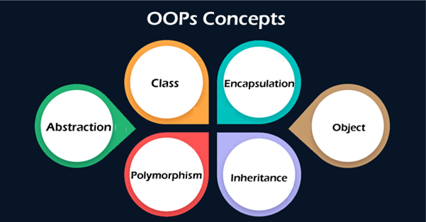
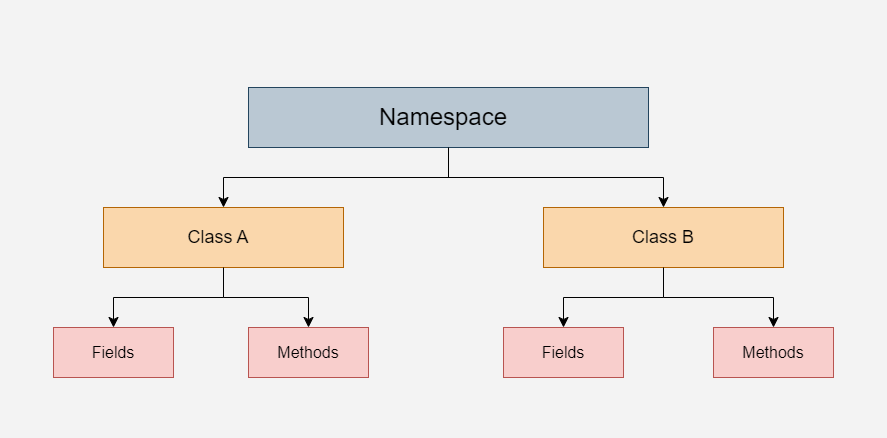

# Learning C#

- [Tutorial](#tutorial)
- [Methods](#methods-1)
- [OOPs](#oops---object-oriented-programming-system)

## Tutorial

### 1. Syntax

```C#
using System;

namespace HelloWorld
{
  class Program
  {
    static void Main(string[] args)
    {
      Console.WriteLine("Hello World!");    
    }
  }
}
```

### 2. Output

```C#
Console.Write("Hello World!");
Console.WriteLine("Hello World!");
```

### 3. Comments

```C#
// This is a comment
/* The code below will print the words Hello World
to the screen, and it is amazing */
Console.WriteLine("Hello World!");
```

### 4. Variables

```C#
int myNum = 5;
double myDoubleNum = 5.99D;
char myLetter = 'D';
bool myBool = true;
string myText = "Hello";
```

```C#
int x = 5, y = 6, z = 50;
Console.WriteLine(x + y + z);
```

```C#
const int myNum = 15;
myNum = 20; // error
```

### 5. Type Casting

- Implicit Casting (automatically) - converting a smaller type to a larger type size
char -> int -> long -> float -> double

- Explicit Casting (manually) - converting a larger type to a smaller size type
double -> float -> long -> int -> char

```C#
Console.WriteLine(Convert.ToString(myInt));    // convert int to string
Console.WriteLine(Convert.ToDouble(myInt));    // convert int to double
Console.WriteLine(Convert.ToInt32(myDouble));  // convert double to int
Console.WriteLine(Convert.ToString(myBool));   // convert bool to string
```

### 6. User Input

```C#
string userName = Console.ReadLine();
```

### 7. Operators

- Arithmetic: +, -, *, /, %, ++, --
- Assignment: =, +=, -=, *=, /=
- Comparison: ==, !=, >, <, >=, <=
- Logical: &&, ||, !

### 8. Math

- Math.Max(x,y)
- Math.Min(x,y)
- Math.Sqrt(x)
- Math.Abs(x)
- Math.Round()

### 9. Strings

#### Methods

```C#
string txt = "This is C# demo";
txt.Length();
txt.ToUpper();
txt.ToLower();
```

#### String Concatenation

```C#
string firstName = "John ";
string lastName = "Doe";
string name = firstName + lastName;
string name = string.Concat(firstName, lastName);
```

#### String Interpolation

- String Interpolation substitutes values of variables into placeholders in a string

```C#
string firstName = "John";
string lastName = "Doe";
string name = $"My full name is: {firstName} {lastName}";
```

#### Access Strings

```C#
string myString = "Hello";
Console.WriteLine(myString[0]);  // Outputs "H"
```

```C#
string myString = "Hello";
Console.WriteLine(myString.IndexOf("e")); // Outputs 1
```

```C#
string name = "John Doe";
string lastName = name.Substring(5); // Outputs Doe
```

### If-else-elseif

```C#
if (condition1)
{
  // block of code to be executed if condition1 is True
} 
else if (condition2) 
{
  // block of code to be executed if the condition1 is false and condition2 is True
} 
else
{
  // block of code to be executed if the condition1 is false and condition2 is False
}
```

```C#
// variable = (condition) ? expressionTrue :  expressionFalse;
string result = (time < 18) ? "Good day." : "Good evening.";
```

### Switch

```C#
switch(expression) 
{
  case x:
    // code block
    break;
  case y:
    // code block
    break;
  default:
    // code block
    break;
}
```

### While Loop

```C#
while (condition) 
{
  // code block to be executed
}
```

```C#
int i = 0;
do 
{
  Console.WriteLine(i);
  i++;
}
while (i < 5);
```

### For Loop

```C#
for (int i = 0; i < 5; i++) 
{
  Console.WriteLine(i);
}
```

```C#
string[] cars = {"Volvo", "BMW", "Ford", "Mazda"};
foreach (string i in cars) 
{
  Console.WriteLine(i);
}
```

### Arrays

#### Sorting Arrays

```C#
string[] cars = {"Volvo", "BMW", "Ford", "Mazda"};
Array.Sort(cars);
foreach (string i in cars)
{
  Console.WriteLine(i);
}
```

#### Multidimentional Arrays

```C#
int[,] numbers = { {1, 4, 2}, {3, 6, 8} };
Console.WriteLine(numbers[0, 2]);  // Outputs 2
```

## Methods

[Home](#learning-c)

- Methods are used to perform certain actions, and they are also known as functions.
- A method is a block of code which only runs when it is called.
- You can pass data, known as parameters, into a method.

#### Creating a Method

```C#
static void MyMethod() 
{
  Console.WriteLine("I just got executed!");
}

static void Main(string[] args)
{
  MyMethod();
}

// Outputs "I just got executed!"
```

#### Parameters

```C#
static void MyMethod(string fname, string country = "India") 
{
  Console.WriteLine(fname + " " + country);
}

static void Main(string[] args)
{
  MyMethod("Jenny", "Sweden");
  MyMethod("Preeta");
}
```

```C#
static void MyMethod(string child1, string child2, string child3) 
{
  Console.WriteLine("The youngest child is: " + child3);
}

static void Main(string[] args)
{
  MyMethod(child3: "John", child1: "Liam", child2: "Liam");
}

// The youngest child is: John
```

#### Return Values

```C#
static int MyMethod(int x, int y) 
{
  return x + y;
}

static void Main(string[] args)
{
  int z = MyMethod(5, 3);
  Console.WriteLine(z);
}

// Outputs 8 (5 + 3)
```

## OOPs - Object Oriented Programming System

[Home](#learning-c)

#### Advantages of OOPs

- It provides a clear structure for the programs
- It helps to keep the C# code DRY "Don't Repeat Yourself"
- It makes the code easier to maintain, modify and debug
- It makes it possible to create full reusable applications with less code and shorter development time



## Classes and Objects

- Class is a template for an object
- Object is an instance of a class

### Examples


### Creating an object

```C#
class Car 
{
  static void Main(string[] args)
  {
    Car mycar = new Car();
  }
}
```

## Class Members - Fields and Methods

- Objects inherit all fields and methods from the class



```C#
// Program.cs
using System;

namespace MyApplication
{
  class Car
  {
    public string color = "Red";      // Field or Attribute
    public string brand = "Ford";     // Field or Attribute
    public void honk()               // Method or Function
  {                    
    Console.WriteLine("Tuut, tuut!");
  }
  }

  class Bike
  {
    public string color = "Black";             // Field or Attribute
    public string brand = "Royal Enfield";     // Field or Attribute
    public void honk()                         // Method or Function
  {                    
    Console.WriteLine("Vroom, Vroom!");
  }
  }
}

// Program2.cs
using System;

namespace MyApplication
{
  class Program
  {
    static void Main(string[] args)
    {
      Car myCar = new Car();
      Bike myBike = new Bike();
      Console.WriteLine(myCar.color);    // Outputs Red
      Console.WriteLine(myBike.brand);   // Outputs Royal Enfield
      myCar.honk();                      // Outputs "Tuut, tuut!"
      myBike.honk();                     // Outputs "Vroom, Vroom!"
    }
  }
}
```

```C#

// Program.cs

using System;

namespace MyApplication
{
  class Car
  {
    public string model;
    public string color;
    public int year;
    public void fullThrottle()
    {
      Console.WriteLine("The car is going as fast as it can!"); 
    }
  }
}

// Program2.cs

using System;

namespace MyApplication
{
  class Program
  {
    static void Main(string[] args)
    {
      Car Ford = new Car();
      Ford.model = "Mustang";
      Ford.color = "red";
      Ford.year = 1969;

      Car Opel = new Car();
      Opel.model = "Astra";
      Opel.color = "white";
      Opel.year = 2005;

      Console.WriteLine(Ford.model);
      Console.WriteLine(Opel.model);
    }
  }
}
```

### Constructors

-  Constructors cannot have a return type (like void or int)

```C#
class Car
{
  public string model;
  public string color;
  public int year;

  // Create a class constructor with multiple parameters
  public Car(string modelName, string modelColor, int modelYear)
  {
    model = modelName;
    color = modelColor;
    year = modelYear;
  }

  static void Main(string[] args)
  {
    Car Ford = new Car("Mustang", "Red", 1969);
    Console.WriteLine(Ford.color + " " + Ford.year + " " + Ford.model);
  }
}


// Outputs Red 1969 Mustang
```

### Access Modifiers


- Static - Related to the type itself, rather than an instance of the type
- Void - Does not have a return type

## Encapsulation

- It is used to make sure that "sensitive" data is hidden from users
- Fields should be declared as private

```C#
class Person
{
  private string name; // field
  public string Name   // property
  {
    get { return name; }
    set { name = value; }
  }
}

class Program
{
  static void Main(string[] args)
  {
    Person myObj = new Person();
    myObj.Name = "Liam";
    Console.WriteLine(myObj.Name);
  }
}
```

## Inheritance

- Derived Class (child) - the class that inherits from another class
- Base Class (parent) - the class being inherited from

```C#
class Vehicle  // base class (parent) 
{
  public string brand = "Ford";  // Vehicle field
  public void honk()             // Vehicle method 
  {                    
    Console.WriteLine("Tuut, tuut!");
  }
}

class Car : Vehicle  // derived class (child)
{
  public string modelName = "Mustang";  // Car field
}

class Program
{
  static void Main(string[] args)
  {
    // Create a myCar object
    Car myCar = new Car();

    // Call the honk() method (From the Vehicle class) on the myCar object
    myCar.honk();

    // Display the value of the brand field (from the Vehicle class) and the value of the modelName from the Car class
    Console.WriteLine(myCar.brand + " " + myCar.modelName);
  }
}
```

## Polymorphism

- Polymorphism means "many forms"
- Allows us to perform a single action in different ways

```C#
class Animal  // Base class (parent) 
{
  public void animalSound() 
  {
    Console.WriteLine("The animal makes a sound");
  }
}

class Pig : Animal  // Derived class (child) 
{
  public void animalSound() 
  {
    Console.WriteLine("The pig says: wee wee");
  }
}

class Dog : Animal  // Derived class (child) 
{
  public void animalSound() 
  {
    Console.WriteLine("The dog says: bow wow");
  }
}
```

## Abstraction

- It is the process of hiding certain details and showing only essential information to the user
- Abstract class: is a restricted class that cannot be used to create objects (to access it, it must be inherited from another class)
- Abstract method: can only be used in an abstract class, and it does not have a body. The body is provided by the derived class (inherited from)

```C#
// Abstract class
abstract class Animal
{
  // Abstract method (does not have a body)
  public abstract void animalSound();
}
```

## Interfaces

- An interface is a completely "abstract class"
- It can only contain abstract methods and properties (with empty bodies)
- Like abstract classes, interfaces cannot be used to create objects
- Interfaces can contain properties and methods, but not fields/variables

```C#
// interface
interface Animal 
{
  void animalSound(); // interface method (does not have a body)
  void run(); // interface method (does not have a body)
}
```

[Home](#learning-c)
